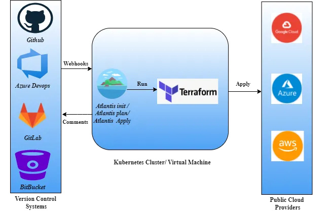

# Atlantis

Atlantis is an open-source technology that allows the engineer/approver to review the changes in the infrastructure as well as evaluate that the proposed change is the actual change that will be executed on your infrastructure before applying it. Atlantis used with Terraform can be used as a CICD for Infrastructure as Code (IAC).

### Atlantis Overview


### Required
- Install eksctl
- helm

---


## Atlantis using Helm chart

### Files

`atlantis.yaml` -  project configuration for atlantis

`atlantis-value.yml` - Helm values for atlantis

---

### Create cluster using eksctl

```
eksctl create cluster -f cluster.yaml
```

###  CSI driver installation
A PersistentVolume will be required for Atlantis to manage local state.

- Enable IAM OIDC provider:
  ```
  eksctl utils associate-iam-oidc-provider --region=<Your_Region> --cluster=<Your_ClusterName> --approve
  ```

- Create a Service Account for the Amazon EBS CSI driver role:
  ```
   eksctl create iamserviceaccount \
  --name ebs-csi-controller-sa \
  --namespace kube-system \
  --cluster atlantis-cluster \
  --attach-policy-arn arn:aws:iam::aws:policy/service-role/AmazonEBSCSIDriverPolicy \
  --approve \
  --role-only \
  --region us-east-1 \
  --role-name AmazonEKS_EBS_CSI_DriverRole
  ```
- Add the Amazon EBS CSI add-on:
  ```
  eksctl create addon --name aws-ebs-csi-driver --cluster atlantis-cluster --region us-east-1 --service-account-role-arn arn:aws:iam::<accountid>:role/AmazonEKS_EBS_CSI_DriverRole --force
  ```

### Helm Chart

We will use the official helm chart to install Atlantis on an AWS EKS cluster.


```
helm repo add runatlantis https://runatlantis.github.io/helm-charts
```

```
git clone https://github.com/kishoredurai/atlantis.git
```

Update github credential values in `atlantis-value.yml`


```
helm upgrade -i atlantis runatlantis/atlantis -f atlantis-values.yaml
```

### Deployment
the Atlantis server is exposed as a load balancer

```
kubectl get svc --namespace default atlantis -o jsonpath='{.status.loadBalancer.ingress[0].hostname}'
```


### Configuring Github app

- Visit `https://$ATLANTIS_HOST/github-app/setup` and click on Setup to create the app on GitHub.


Add below code to `atlantis-value.yml`

```yaml
githubApp:
  id: ****
  secret: ****
  key: *****

```


### Add On Integration

#### Infracost 
Infracost its a tool that can calculate cost estimates of infrastructure and comments on our PR
https://www.infracost.io/